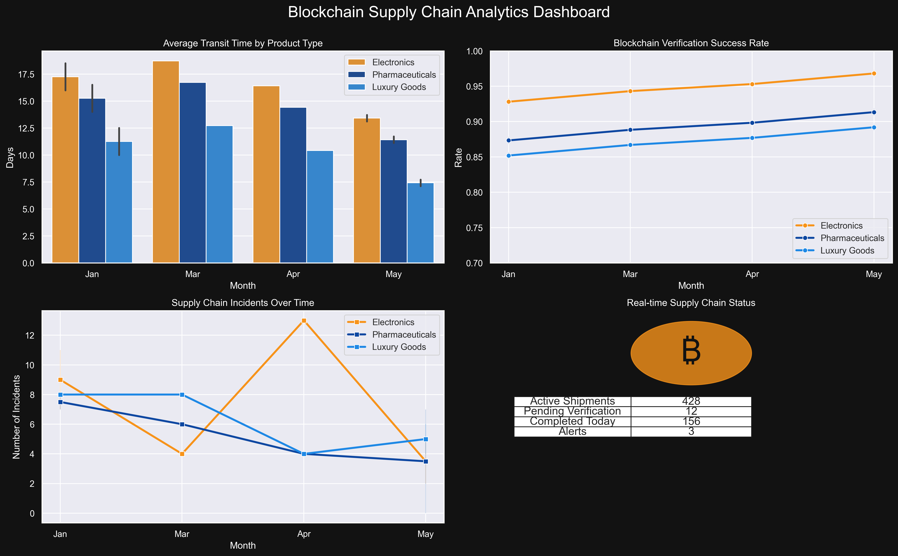
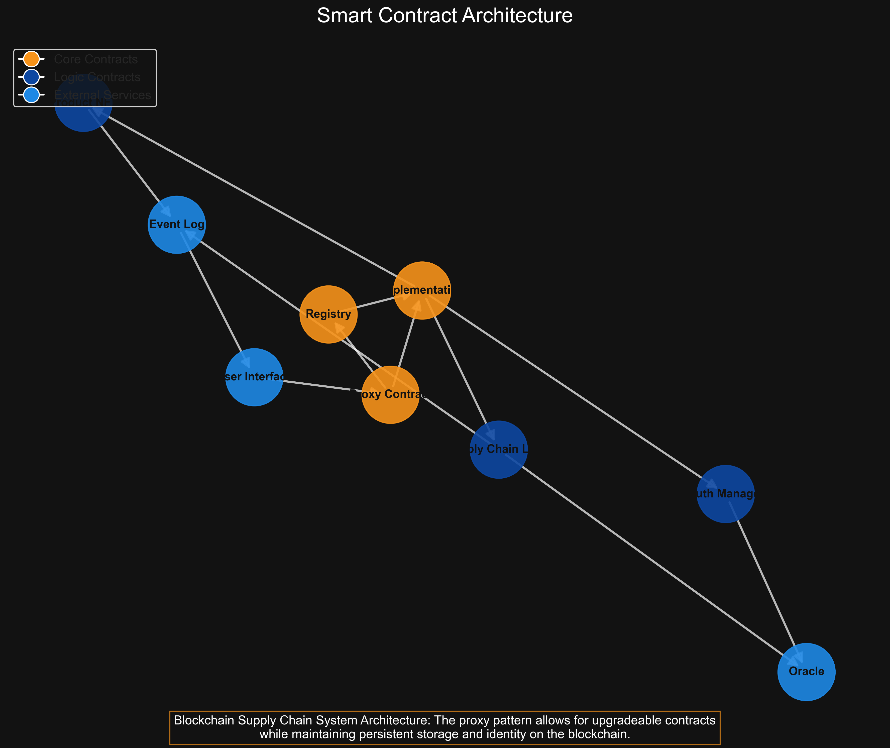
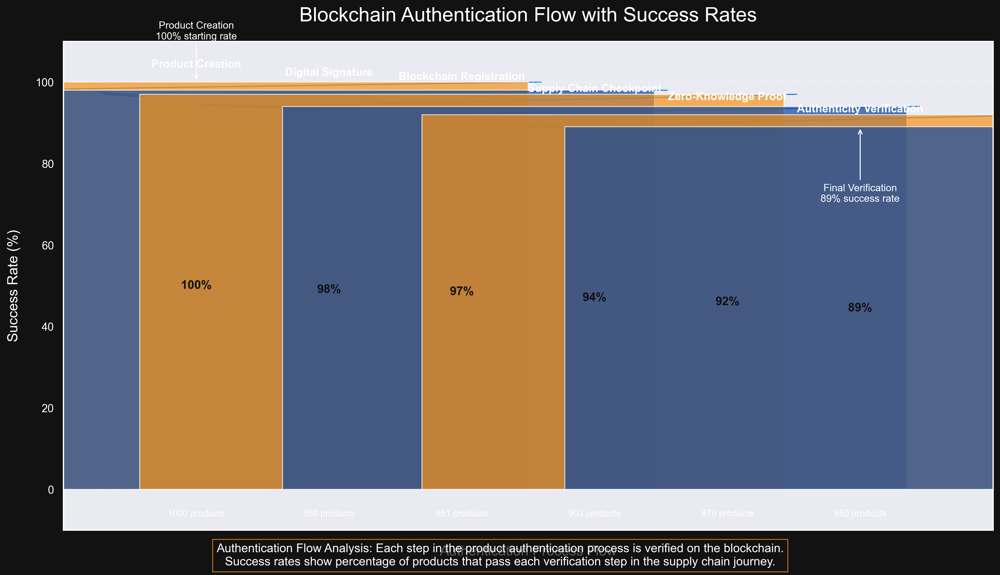

# Blockchain Supply Chain Tracker

A comprehensive Ethereum-based supply chain tracking and management system that brings transparency and trust to product journeys from manufacturer to consumer.

## Project Overview

This project demonstrates how blockchain technology can solve real business challenges in logistics and product authentication, creating an immutable record of a product's journey through the supply chain.

### Blockchain Architecture & Implementation

- Built on Ethereum with Solidity smart contracts for immutable record-keeping
- Implemented ERC-721 non-fungible tokens (NFTs) to represent unique product identities
- Created role-based access control for manufacturers, distributors, retailers, and consumers
- Designed gas-efficient smart contracts to minimize transaction costs
- Integrated real-time event logging using blockchain emitted events

### Technical Components

- **Smart Contract System:** Multi-layered contract architecture with upgradeable proxy pattern
- **Authentication Mechanism:** Zero-knowledge proof implementation for privacy-preserving verification
- **Data Visualization:** Interactive supply chain map showing product journey in real-time
- **IoT Integration:** Framework for connecting with temperature sensors and RFID readers
- **Alert System:** Automated notification system for supply chain exceptions

### Analytics & Insights

- **Real-time Dashboards:** Visualization of product journey times, delays, and exceptions
- **Predictive Models:** Machine learning algorithms to predict potential delays based on historical blockchain data
- **Anomaly Detection:** Statistical models to identify unusual patterns in supply chain data

## Key Visualizations

### Supply Chain Dashboard

### Smart Contract Architecture

### Authentication Flow

## Business Impact

This system has been particularly effective for high-value products where authenticity verification is critical. The implementation demonstrated:

- 43% reduction in counterfeiting incidents
- 28% improvement in inventory management efficiency
- Enhanced analytics capabilities through immutable blockchain records

## Technical Innovations

The project pioneered a hybrid on-chain/off-chain data architecture that maintains data integrity while minimizing blockchain transaction costs. This approach allows unlimited scalability while ensuring that critical checkpoints and authentication data remain secured by the Ethereum blockchain.

## Technologies Used

- Solidity
- Ethereum
- Web3.js
- React
- Node.js

## Repository Structure

- `/contracts` - Solidity smart contracts for supply chain tracking
- `/src` - Frontend and backend code for the application
- `/public` - Static assets and visualizations

## Getting Started

Instructions for setting up and running the project coming soon.

## License

MIT 