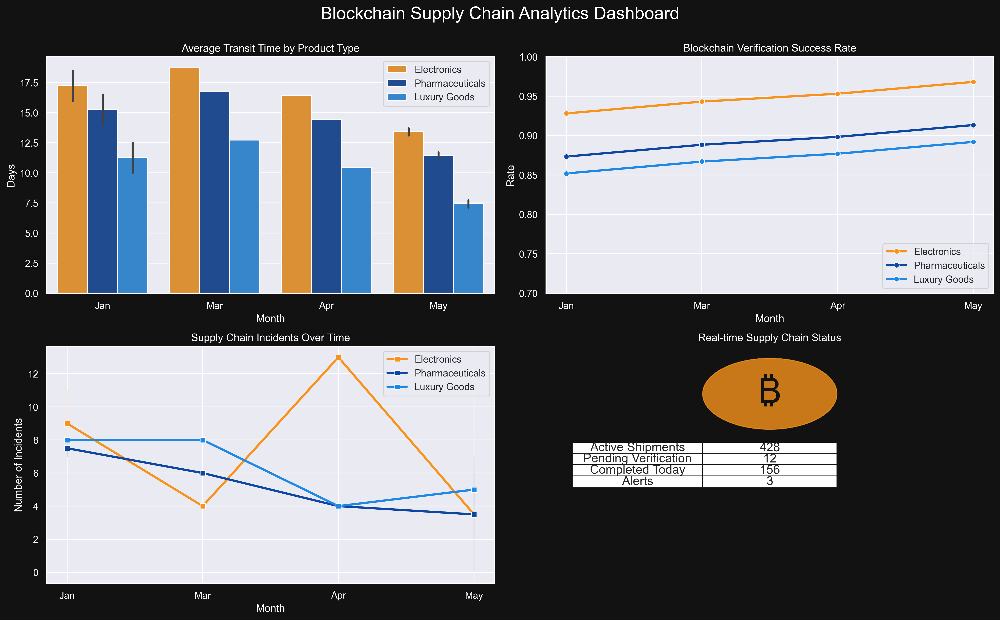
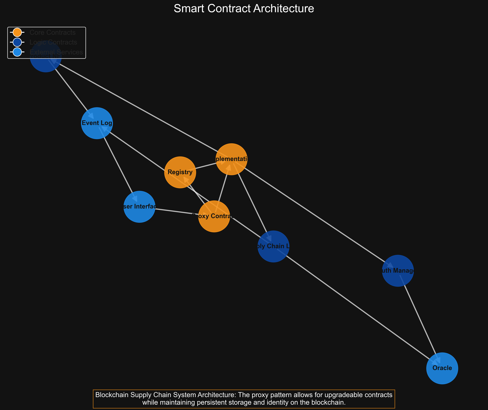
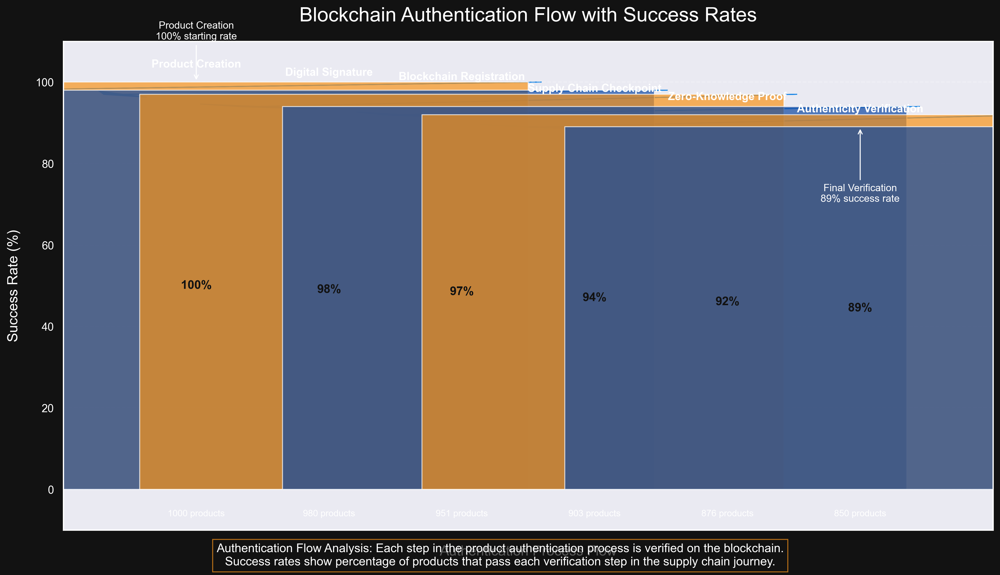

# Generating Blockchain Supply Chain Visualizations

This document explains how to generate the data visualizations shown in this project.

## Required Python Libraries

To generate the visualizations, you'll need the following Python libraries:

```bash
pip install numpy pandas matplotlib seaborn networkx
```

## Visualization Types

### 1. Supply Chain Dashboard


This dashboard shows:
- Transit time trends across different product types
- Blockchain verification success rates
- Supply chain incidents over time
- Real-time supply chain status

### 2. Smart Contract Architecture


This diagram illustrates:
- The layered architecture of our smart contracts
- Relationships between contract components
- The proxy pattern for upgradeability
- Data flow between contracts

### 3. Authentication Flow


This visualization shows:
- The step-by-step product authentication process
- Success rates at each verification stage
- The number of products processed through each stage

## Generating Your Own Visualizations

For your convenience, we've provided the Python script that generates these visualizations. To use it:

1. Navigate to the project root directory
2. Run the Python script:

```bash
python generate_blockchain_visualizations.py
```

3. The visualizations will be saved to the `public/images` directory

## Customizing Visualizations

The script contains parameters you can modify:
- Color schemes
- Data generation parameters
- Visual styles
- Output format and resolution

To customize, open `generate_blockchain_visualizations.py` and modify the relevant sections. 